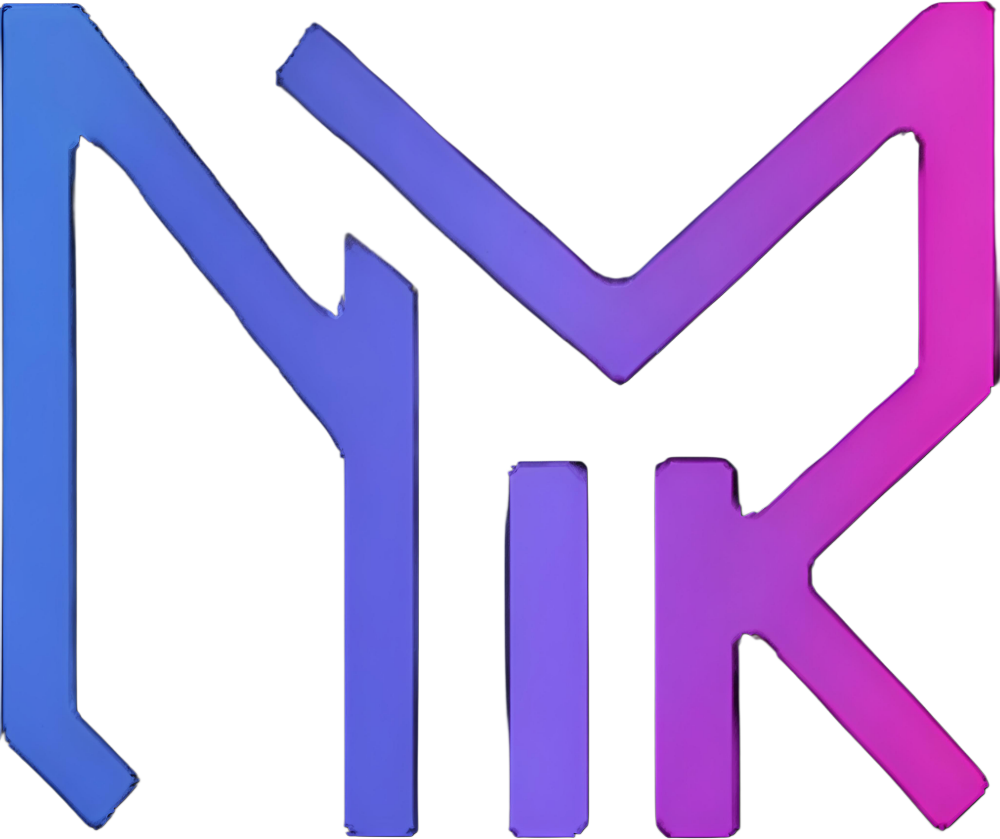

<h1 align="center">
   
  QuadrMinds Technologies
 </h1>

<h2 align="center"> Powered by 4 Cores 🚀</h2>
<h3 align="center">Building Intelligent Solutions for Tomorrow's Challenges</h3>

  <a href="https://quadrminds-portfolio.netlify.app">🌐 Portfolio</a> •
  <a href="https://www.linkedin.com/company/quadrminds-technologies/">💼 LinkedIn</a> •
  <a href="https://github.com/QuadrMinds-Technologies">🐙 GitHub</a>

---

## 🧠 About Us
QuadrMinds Technologies is a forward-thinking technology organization dedicated to creating **intelligent, scalable, and secure systems** that drive real-world impact.  
We specialize in **DevOps, Cloud Architecture, AI/ML solutions, and Full-Stack Development** — delivering cutting-edge solutions that automate and enhance business processes.

Our team thrives on **innovation**, constantly exploring new technologies that merge **automation, intelligence, and reliability** in modern software ecosystems.

---

## 💡 What We Do

### 🔧 Core Competencies
- **Cloud & DevOps** – Scalable infrastructure and CI/CD pipelines  
- **AI/ML Solutions** – Intelligent systems and predictive analytics  
- **Full-Stack Development** – End-to-end web and mobile applications  
- **System Architecture** – Secure, high-performance system design  
- **Automation** – Process optimization and workflow automation  

---

## 🧠 Skills & Tooling  

### 💻 Languages  

### 🧰 Libraries & Frameworks  

### ☁️ DevOps & Cloud Tools  

---

## 📂 Our Projects
We build solutions across various domains:  
- Enterprise Automation Systems  
- AI-Powered Analytics Platforms  
- Scalable Web & Mobile Applications  
- Cloud Migration & Optimization  
- IoT and Smart Systems  

---

## 🤝 Connect With Us
🌐 **Portfolio:** [quadrminds-portfolio.netlify.app](https://quadrminds-portfolio.netlify.app)  
💼 **LinkedIn:** [QuadrMinds Technologies](https://www.linkedin.com/company/quadrminds-technologies/)  
🐙 **GitHub:** [QuadrMinds-Technologies](https://github.com/QuadrMinds-Technologies)  
📧 **Email:** quadrminds.technologies@gmail.com  

---

## 💻 Open Source
We believe in the **power of community and open source**.  
Check out our repositories for tools, libraries, and projects we're contributing to the developer ecosystem.

---

  <b>QuadrMinds Technologies</b> – Engineering Intelligence, Delivering Impact 💡  
   
  Built with ❤️ by the QuadrMinds Core Team

